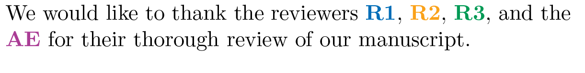

# A LaTeX template for writing beautiful point-by-point responses

A Package and template for writing beautiful and nicely structured point-by-point responses.


### Example Document
An example document using the package is provided as `main.tex` and on [Overleaf](https://www.overleaf.com/read/pspvwrsdytzf#92f923). This should be a great starting point for your point-by-point response!

### Load the Package
Load the package using `\usepackage{pbyp}` with `pbyp.sty` in the same directory as your `main.tex`.

The package accepts the optional keyword arguments `revAEcol, revAcol, revBcol, ..., revFcol` to define different colors for the reviewers. The colors must be one of the standard colors or dvipsnames of `xcolor`. For an overview of available colors see [here](https://www.namsu.de/Extra/pakete/Xcolor.html). E.g., to color the associate editor in red and the first reviewer in green use
```
\usepackage[revAEcol=Brickred,revAcol=ForestGreen]{pbyp}
```

### Functionality
#### Questions and Responses
We use theorem environments to create the question and response blocks. E.g., to answer the first question of the first reviewer we could do the following
```
\begin{question}{\QuestionRevA{Q1}}
some question
\end{question}

\begin{response}
some response
\end{response}
```


where `\QuestionRevA` indicates the first reviewer (we could use `\QuestionRevAE` for the AE or `\QuestionRevB, \QuestionRevC,...` for the other reviewers). The question name is provided as argument to the question command. E.g., to give the questions more meaningful names such as `R1.Dataset` or `R2.General`, we could use
```
\begin{question}{\QuestionRevA{Dataset}}
some question about the dataset
\end{question}

\begin{question}{\QuestionRevB{General}}
some general comment
\end{question}
```


We can also label questions to reference them later in one of our responses.
```
\begin{question}{\QuestionRevA{Dataset}}\label{R1:Dataset}
some question
\end{question}

\begin{response}
some response
\end{response}

\begin{question}{\QuestionRevB{Q1}}\label{R2:Q1}
some question
\end{question}

\begin{response}
some response
\end{response}

\begin{question}{\QuestionRevC{Q1}}
some question
\end{question}

\begin{response}
See our response to \cref{R1:Dataset,R2:Q1}
\end{response}
```


#### Textboxes
Sometimes you want to copy some text from your revised manuscript to the point-by-point response to save the busy reviewers some time. This can be done using the `revised` environment:
```
\begin{question}{\QuestionRevA{Q1}}
Please add this in your manuscript
\end{question}

\begin{response}
We updated this in our manuscript:
    \begin{revised}
    We greatly improved our manuscript by incorporating everything that the reviewer suggested!
    \end{revised}
\end{response}
```


#### Reference Reviewers
You can reference reviewers or the associate editor to write things like:



To reference the AE use the command `\revAE`. To reference the individual reviewers use `\revA, \revB,...,\revF` or `\rev{1}, \rev{2}, ... \rev{6}` (we don't support more than 6 reviewers + AE)

#### Line Number Placeholders
You can insert placeholders for line numbers to be added later using `\addlines`

